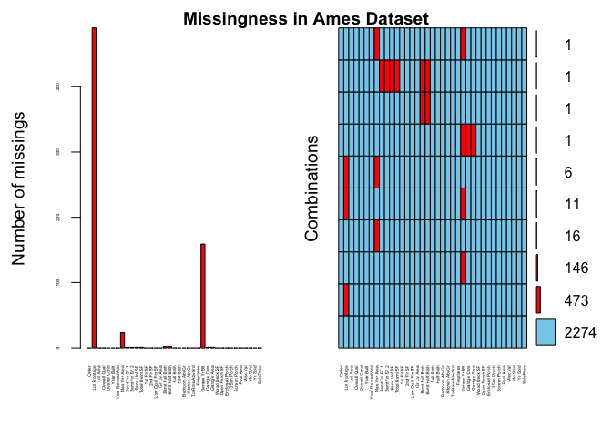
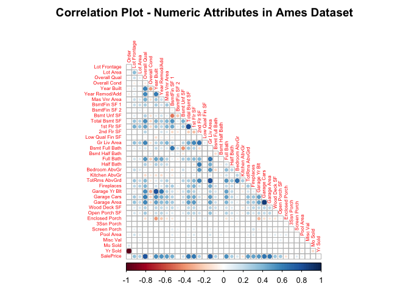
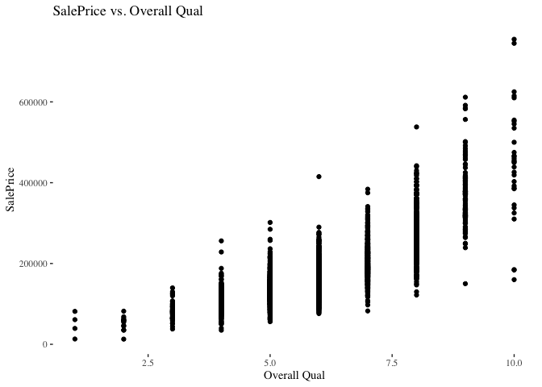
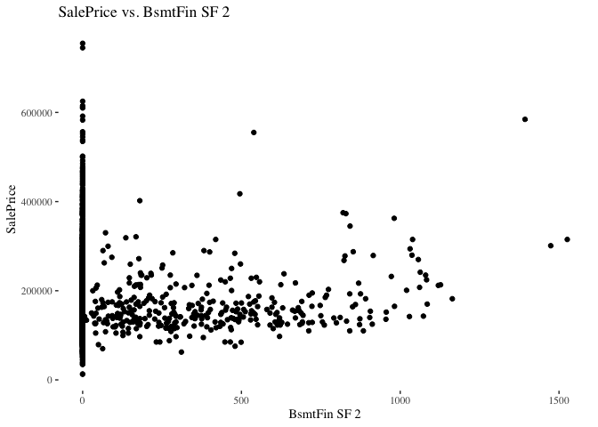
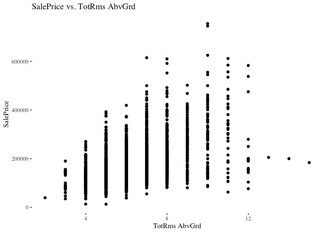
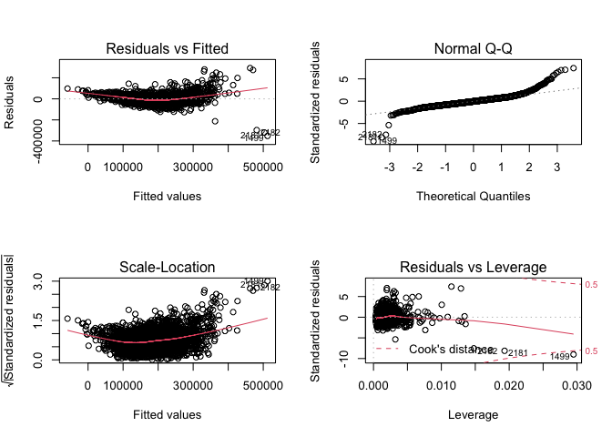
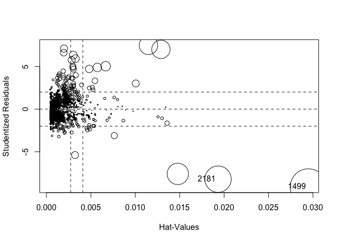
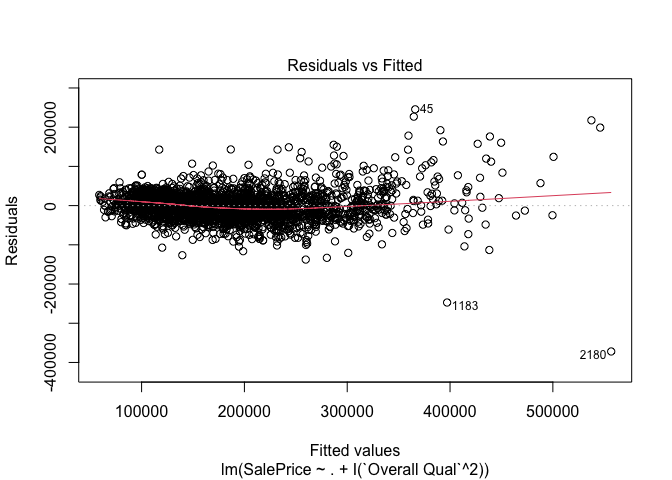
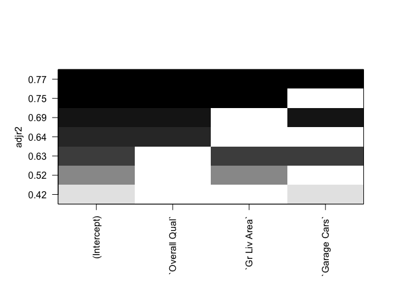

Module 1 — Regression Diagnostics with R
================
Justin Ehringhaus
September 25, 2022

-   <a href="#introduction" id="toc-introduction">Introduction</a>
-   <a href="#analysis" id="toc-analysis">Analysis</a>
    -   <a href="#importing-and-previewing-the-dataset"
        id="toc-importing-and-previewing-the-dataset">Importing and Previewing
        the Dataset</a>
    -   <a href="#imputing-missing-values"
        id="toc-imputing-missing-values">Imputing Missing Values</a>
    -   <a href="#correlations-with-saleprice"
        id="toc-correlations-with-saleprice">Correlations with SalePrice</a>
    -   <a href="#plotting-against-saleprice"
        id="toc-plotting-against-saleprice">Plotting Against SalePrice</a>
    -   <a href="#modeling-multiple-linear-regression"
        id="toc-modeling-multiple-linear-regression">Modeling: Multiple Linear
        Regression</a>
    -   <a href="#diagnostics-multiple-linear-regression"
        id="toc-diagnostics-multiple-linear-regression">Diagnostics: Multiple
        Linear Regression</a>
-   <a href="#conclusioninterpretations"
    id="toc-conclusioninterpretations">Conclusion/Interpretations</a>
-   <a href="#references" id="toc-references">References</a>

------------------------------------------------------------------------

## Introduction

This assignment explores multiple linear regression and regression
diagnostics using a dataset on residential properties sold between 2006
to 2010 in Ames, Iowa. The Ames dataset contains 2930 observations and
82 variables, including features such as year sold, neighborhood name,
type of foundation, electrical system, sale price, and many more. The
original dataset was assembled by the Ames Assessor’s Office for tax
assessment purposes but its variables closely match what a typical
homebuyer might want to know prior to purchasing a house, and thus this
dataset can be used to make useful predictions that could benefit real
estate agents or homebuyers such as predicting the best price of a home
given certain features.

To simplify the analysis, in this assignment I am concerned only with
ordinal or discrete numeric variables (i.e., non-nominal and
non-character variables), but it should be noted that a fuller analysis
could recode nominal, character variables and include them in the linear
regression models.

I will first perform an exploratory data analysis, including an
evaluation of “missingness,” to understand the general shape of the
dataset and to fill in the blanks where missing data is present. Next, I
will consider what variables to include as predictor variables in the
multiple linear regression by assessing the strengths of correlations of
each to the `SalePrice` variable. My purpose, here, is to understand
what variables have the greatest predictive powers when regressing onto
the outcome variable, `SalePrice`. After having built an initial model
using those selected variables, I will diagnose and attempt to improve
the model by assessing linear model assumptions such as its normality,
nonlinearity, homoscedasticity, and multicollinearity. These terms will
be defined and explored further in the following analysis. Finally, I
will reflect on whether my regression diagnostics have led to an
improved model.

------------------------------------------------------------------------

``` r
# █▀█ █▀▀ █▀ █▀▀ ▀█▀ █▀
# █▀▄ ██▄ ▄█ ██▄ ░█░ ▄█
# clear console
cat("\014")
```



``` r
# clear global environment
rm(list = ls())
# clear plots
try(dev.off(dev.list()["RStudioGD"]), silent = TRUE)
# clear packages
try(p_unload(p_loaded(), character.only = TRUE), silent = TRUE)
# disables scientific notion for entire R session
options(scipen = 100)
```

``` r
# █▀█ ▄▀█ █▀▀ █▄▀ ▄▀█ █▀▀ █▀▀ █▀
# █▀▀ █▀█ █▄▄ █░█ █▀█ █▄█ ██▄ ▄█
library(pacman)
p_load(tidyverse)     # the usual suite of packages
p_load(skimr)         # alternative to summary(), skims dataset
p_load(corrplot)      # visualization of a correlation matrix
p_load(ggthemes)      # extra ggplot themes
p_load(equatiomatic)  # extract equation from model
p_load(car)           # Companion to Applied Regression
p_load(leaps)         # exhaustive search of best model(s)
p_load(gvlma)         # assessment of linear models assumptions
p_load(VIM)           # visualization of missing values
```

------------------------------------------------------------------------

## Analysis

#### Importing and Previewing the Dataset

To begin, I will load the dataset as a tibble and confirm its successful
importation by using the `head()` function to view the first few rows
and slicing the result to check the first few columns.

``` r
# ░░███╗░░Load the Ames housing dataset.
# ░████║░░
# ██╔██║░░
# ╚═╝██║░░
# ███████╗
# ╚══════╝
# reading csv into tibble
ames <- read_csv("AmesHousing.csv")
```

    ## Rows: 2930 Columns: 82
    ## ── Column specification ────────────────────────────────────────────────────────
    ## Delimiter: ","
    ## chr (45): PID, MS SubClass, MS Zoning, Street, Alley, Lot Shape, Land Contou...
    ## dbl (37): Order, Lot Frontage, Lot Area, Overall Qual, Overall Cond, Year Bu...
    ## 
    ## ℹ Use `spec()` to retrieve the full column specification for this data.
    ## ℹ Specify the column types or set `show_col_types = FALSE` to quiet this message.

``` r
# checking first few rows/cols for successful import
head(ames)[,1:6]
```

    ## # A tibble: 6 × 6
    ##   Order PID        `MS SubClass` `MS Zoning` `Lot Frontage` `Lot Area`
    ##   <dbl> <chr>      <chr>         <chr>                <dbl>      <dbl>
    ## 1     1 0526301100 020           RL                     141      31770
    ## 2     2 0526350040 020           RH                      80      11622
    ## 3     3 0526351010 020           RL                      81      14267
    ## 4     4 0526353030 020           RL                      93      11160
    ## 5     5 0527105010 060           RL                      74      13830
    ## 6     6 0527105030 060           RL                      78       9978

As explained in the introduction, I will only include numeric variables
and drop all others. The `skim()` function from the skimr package
provides a more in-depth version of the base `summary()` function. In
it, we see there is some *missingness* (i.e., missing values are present
and the completion rate is not 100%).

The histograms also reveal that there is left or right skewness present
in many of the variables. This is expected as most features in this
dataset such as `Garage Area` have similar values falling predominantly
on one end of the curve with some outliers on the other end of the
curve. On the other hand, instances where there is little to no skewness
such as in `Overall Qual` show how the majority of values fall in the
middle (i.e., decent quality) with some outliers being very good or very
bad.

``` r
# ██████╗░Perform Exploratory Data Analysis 
# ╚════██╗and use descriptive statistics to describe the data.
# ░░███╔═╝
# ██╔══╝░░
# ███████╗
# ╚══════╝
# separately saving variables with a class type of "numeric"
ames_numeric <- ames %>% select(names(which(lapply(ames, class) == "numeric")))
# checking the shape and summary of the dataset
myskim <- skim(ames_numeric) %>% select(-starts_with('numeric.p'))
myskim
```

|                                                  |              |
|:-------------------------------------------------|:-------------|
| Name                                             | ames_numeric |
| Number of rows                                   | 2930         |
| Number of columns                                | 37           |
| \_\_\_\_\_\_\_\_\_\_\_\_\_\_\_\_\_\_\_\_\_\_\_   |              |
| Column type frequency:                           |              |
| numeric                                          | 37           |
| \_\_\_\_\_\_\_\_\_\_\_\_\_\_\_\_\_\_\_\_\_\_\_\_ |              |
| Group variables                                  | None         |

Data summary

**Variable type: numeric**

| skim_variable   | n_missing | complete_rate |      mean |       sd | hist  |
|:----------------|----------:|--------------:|----------:|---------:|:------|
| Order           |         0 |          1.00 |   1465.50 |   845.96 | ▇▇▇▇▇ |
| Lot Frontage    |       490 |          0.83 |     69.22 |    23.37 | ▇▃▁▁▁ |
| Lot Area        |         0 |          1.00 |  10147.92 |  7880.02 | ▇▁▁▁▁ |
| Overall Qual    |         0 |          1.00 |      6.09 |     1.41 | ▁▂▇▅▁ |
| Overall Cond    |         0 |          1.00 |      5.56 |     1.11 | ▁▁▇▅▁ |
| Year Built      |         0 |          1.00 |   1971.36 |    30.25 | ▁▂▃▆▇ |
| Year Remod/Add  |         0 |          1.00 |   1984.27 |    20.86 | ▅▂▂▃▇ |
| Mas Vnr Area    |        23 |          0.99 |    101.90 |   179.11 | ▇▁▁▁▁ |
| BsmtFin SF 1    |         1 |          1.00 |    442.63 |   455.59 | ▇▁▁▁▁ |
| BsmtFin SF 2    |         1 |          1.00 |     49.72 |   169.17 | ▇▁▁▁▁ |
| Bsmt Unf SF     |         1 |          1.00 |    559.26 |   439.49 | ▇▅▂▁▁ |
| Total Bsmt SF   |         1 |          1.00 |   1051.61 |   440.62 | ▇▃▁▁▁ |
| 1st Flr SF      |         0 |          1.00 |   1159.56 |   391.89 | ▇▃▁▁▁ |
| 2nd Flr SF      |         0 |          1.00 |    335.46 |   428.40 | ▇▃▂▁▁ |
| Low Qual Fin SF |         0 |          1.00 |      4.68 |    46.31 | ▇▁▁▁▁ |
| Gr Liv Area     |         0 |          1.00 |   1499.69 |   505.51 | ▇▇▁▁▁ |
| Bsmt Full Bath  |         2 |          1.00 |      0.43 |     0.52 | ▇▆▁▁▁ |
| Bsmt Half Bath  |         2 |          1.00 |      0.06 |     0.25 | ▇▁▁▁▁ |
| Full Bath       |         0 |          1.00 |      1.57 |     0.55 | ▁▇▇▁▁ |
| Half Bath       |         0 |          1.00 |      0.38 |     0.50 | ▇▁▅▁▁ |
| Bedroom AbvGr   |         0 |          1.00 |      2.85 |     0.83 | ▁▇▂▁▁ |
| Kitchen AbvGr   |         0 |          1.00 |      1.04 |     0.21 | ▁▇▁▁▁ |
| TotRms AbvGrd   |         0 |          1.00 |      6.44 |     1.57 | ▁▇▂▁▁ |
| Fireplaces      |         0 |          1.00 |      0.60 |     0.65 | ▇▇▁▁▁ |
| Garage Yr Blt   |       159 |          0.95 |   1978.13 |    25.53 | ▂▇▁▁▁ |
| Garage Cars     |         1 |          1.00 |      1.77 |     0.76 | ▅▇▂▁▁ |
| Garage Area     |         1 |          1.00 |    472.82 |   215.05 | ▃▇▃▁▁ |
| Wood Deck SF    |         0 |          1.00 |     93.75 |   126.36 | ▇▁▁▁▁ |
| Open Porch SF   |         0 |          1.00 |     47.53 |    67.48 | ▇▁▁▁▁ |
| Enclosed Porch  |         0 |          1.00 |     23.01 |    64.14 | ▇▁▁▁▁ |
| 3Ssn Porch      |         0 |          1.00 |      2.59 |    25.14 | ▇▁▁▁▁ |
| Screen Porch    |         0 |          1.00 |     16.00 |    56.09 | ▇▁▁▁▁ |
| Pool Area       |         0 |          1.00 |      2.24 |    35.60 | ▇▁▁▁▁ |
| Misc Val        |         0 |          1.00 |     50.64 |   566.34 | ▇▁▁▁▁ |
| Mo Sold         |         0 |          1.00 |      6.22 |     2.71 | ▅▆▇▃▃ |
| Yr Sold         |         0 |          1.00 |   2007.79 |     1.32 | ▇▇▇▇▃ |
| SalePrice       |         0 |          1.00 | 180796.06 | 79886.69 | ▇▇▁▁▁ |

Another way to assess missingness is the `aggr()` function from the VIM
package, which reveals variables in terms of the count of missing values
(left plot) and the combinations variables with missing values (right
plot). We can see the majority of missing values `Lot Frontage`
variable, which measures the linear feet of street connected to the
property. Overall, the mean completion rate is 0.9937091, which shows
that “missingness” is not a major issue in this dataset.

``` r
par(oma=c(0,0,2,0))
plot(aggr(ames_numeric, plot = FALSE), 
     numbers = TRUE, 
     cex.axis = .3, 
     prop = FALSE)
title("Missingness in Ames Dataset", outer = TRUE)
```

<!-- -->

#### Imputing Missing Values

To prepare the dataset for modeling, missing values may not be present.
I will opt to impute missing values using the variables’ mean value. The
custom `missingness` function below yields a tibble with any variables
containing missing values and their respective percentage of missingness
both prior to, and after, imputing the missing values with column means.
Before imputing, there are 11 variables containing some degree of
missingness, and after imputing there are zero (an empty tibble).

``` r
# ██████╗░Prepare the dataset for modeling by imputing missing values 
# ╚════██╗with the variable's mean value or any other value that you prefer.
# ░█████╔╝
# ░╚═══██╗
# ██████╔╝
# ╚═════╝░
# returns tibble containing variables with percentage of missing data
missinginess <- function(data) {
  myskim <- skim(data)
  tibble(attr = myskim$skim_variable, 
         missing = 100 - round(myskim$complete_rate * 100, 2)) %>% 
  filter(missing > 0)
}

missinginess(ames_numeric)
```

    ## # A tibble: 11 × 2
    ##    attr           missing
    ##    <chr>            <dbl>
    ##  1 Lot Frontage   16.7   
    ##  2 Mas Vnr Area    0.780 
    ##  3 BsmtFin SF 1    0.0300
    ##  4 BsmtFin SF 2    0.0300
    ##  5 Bsmt Unf SF     0.0300
    ##  6 Total Bsmt SF   0.0300
    ##  7 Bsmt Full Bath  0.0700
    ##  8 Bsmt Half Bath  0.0700
    ##  9 Garage Yr Blt   5.43  
    ## 10 Garage Cars     0.0300
    ## 11 Garage Area     0.0300

``` r
# imputing missing data with column means
ames_numeric <- ames_numeric %>% replace_na(., lapply(., mean, na.rm = TRUE))
missinginess(ames_numeric)
```

    ## # A tibble: 0 × 2
    ## # … with 2 variables: attr <chr>, missing <dbl>

#### Correlations with SalePrice

In the next step, I will begin assessing correlation coefficients by
first producing a correlation matrix using the `cor()` function.

``` r
# ░░██╗██╗Use the "cor()" function to produce a
# ░██╔╝██║correlation matrix of the numeric values.
# ██╔╝░██║
# ███████║
# ╚════██║
# ░░░░░╚═╝
ames_corrmtrx <- cor(ames_numeric)
```

The correlation plot below built with the `corrplot()` function reveals
positive and negative correlations by color (blue to red, respectively).
As I will be building models containing `SalePrice` as the outcome
variable, I am most concerned with variables that are strongly
correlated (either positively or negatively) with `SalePrice` in the
final row of the correlation plot below.

``` r
# ███████╗Produce a plot of the correlation matrix,
# ██╔════╝and explain how to interpret it.
# ██████╗░
# ╚════██╗
# ██████╔╝
# ╚═════╝░
# correlation plot
corrplot(ames_corrmtrx, 
         title = "Correlation Plot - Numeric Attributes in Ames Dataset",
         type = c("lower"),
         mar= c(0, 0, 2, 0),
         method = "circle", 
         insig = "blank", 
         diag = FALSE,
         tl.cex = 0.5)
```

<!-- -->

#### Plotting Against SalePrice

The custom `scatter.plot.SalePrice.vs()` function pre-populates a
scatter plot with the Y-variable `SalePrice` (the eventual outcome
variable) and a user-selected X-variable. Below, I select and save
variables that have the highest, lowest, and medium correlation
coefficients with `SalePrice`, and demonstrate scatter plots for each of
these.

``` r
# ░█████╗░Make a scatter plot for the X continuous variable
# ██╔═══╝░with the highest, lowest, and middling (closest to 0.5)
# ██████╗░correlation with SalePrice.
# ██╔══██╗Interpret the scatter plots and describe how the patterns differ.
# ╚█████╔╝
# ░╚════╝░
# Scatter plot for SalePrice with undefined 'x'
scatter.plot.SalePrice.vs <- function(x) {
  ames_numeric %>% 
    ggplot() +
    aes(x = .data[[x]], y = `SalePrice`) +
    geom_point() +
    theme_tufte() +
    ggtitle(paste0("SalePrice vs. ", x))
}

# abs() of variables' correlation coefficient with SalePrice (minus SalesPrice)
SalesPrice.cors <- sort(abs(ames_corrmtrx[, 'SalePrice']), decreasing = TRUE)[-1]
SalesPrice.cors
```

    ##    Overall Qual     Gr Liv Area     Garage Cars     Garage Area   Total Bsmt SF 
    ##     0.799261795     0.706779921     0.647861110     0.640385461     0.632105117 
    ##      1st Flr SF      Year Built       Full Bath  Year Remod/Add   Garage Yr Blt 
    ##     0.621676063     0.558426106     0.545603901     0.532973754     0.510684432 
    ##    Mas Vnr Area   TotRms AbvGrd      Fireplaces    BsmtFin SF 1    Lot Frontage 
    ##     0.505784081     0.495474417     0.474558093     0.432794357     0.340751054 
    ##    Wood Deck SF   Open Porch SF       Half Bath  Bsmt Full Bath      2nd Flr SF 
    ##     0.327143174     0.312950506     0.285056032     0.275893674     0.269373357 
    ##        Lot Area     Bsmt Unf SF   Bedroom AbvGr  Enclosed Porch   Kitchen AbvGr 
    ##     0.266549220     0.182804552     0.143913428     0.128787442     0.119813720 
    ##    Screen Porch    Overall Cond       Pool Area Low Qual Fin SF  Bsmt Half Bath 
    ##     0.112151214     0.101696932     0.068403247     0.037659765     0.035815123 
    ##         Mo Sold      3Ssn Porch           Order         Yr Sold        Misc Val 
    ##     0.035258842     0.032224649     0.031407925     0.030569087     0.015691463 
    ##    BsmtFin SF 2 
    ##     0.005889764

The scatter plot of the variable with the highest correlation to
`SalePrice` is `Overall Qual`. It is left skewed and the ranges of
values from minimum to maximum increase as the value on the X-axis
increases. This suggests that homes with higher quality materials have a
less predictable, more varied `SalePrice`, whereas homes with lower
quality materials are more standardized in terms of `SalePrice`.

The scatter plot of the variable with the lowest correlation to
`SalePrice` is `BsmtFin SF 2`, which measures the square footage of Type
2 basements. It has many zero-values, likely because many homes do not
have, or were not assessed, for type 2 basements and left unmeasured.
Interestingly, `SalePrice` appears rather consistent irrespective of the
square footage of the basement. I would expect basement square footage
mirrors property square footage and that more square footage relates to
higher `SalePrice`, but this scatter plot shows consistency, which makes
me question whether the collectors of this data did a good job at
measuring basement square footage.

The scatter plot of the variable with a medium correlation to
`SalePrice` is `TotRmsAbvGrd`, which measures the total rooms above
grade/ground. Values are more sparse on the right-end (houses with many
rooms) and the ranges of values from minimum to maximum are difficult to
discern as the value on the X-axis increases. This suggests that homes
with more rooms above ground may or may not have a predictable
`SalePrice` but homes with few rooms above ground seem to have a
predicabtly more standardized `SalePrice` (thus the medium-level of
correlation).

``` r
# The variable with the highest correlation to SalePrice
highest.cor <- names(head(SalesPrice.cors, n = 1))
# Plotting highest correlated variable to SalePrice
scatter.plot.SalePrice.vs(highest.cor)
```

<!-- -->

``` r
# The variable with the lowest correlation to SalePrice
lowest.cor <- names(tail(SalesPrice.cors, n = 1))
# Plotting lowest correlated variable to SalePrice
scatter.plot.SalePrice.vs(lowest.cor)
```

<!-- -->

``` r
# The variable with the closest correlation to 0.5
medium.cor <- names(SalesPrice.cors[which.min(abs(SalesPrice.cors - 0.5))])
# Plotting middling correlated variable to SalePrice
scatter.plot.SalePrice.vs(medium.cor)
```

<!-- -->

#### Modeling: Multiple Linear Regression

Taking the top three variables with the strongest correlations (either
positive or negative) to `SalePrice`, in this next section I build a
multiple linear regression model using the default settings and without
any transformations.

``` r
# ███████╗Using at least 3 continuous variables, fit a regression model in R.
# ╚════██║
# ░░░░██╔╝
# ░░░██╔╝░
# ░░██╔╝░░
# ░░╚═╝░░░
# Top three variables with strongest correlation with SalePrice 
top3.cor <- head(abs(SalesPrice.cors), n = 3)

# Regressing the top three correlated variables onto SalePrice 
myfit <- lm(`SalePrice` ~ ., 
            select(ames_numeric, `SalePrice`, names(top3.cor)))
```

The `extract_eq()` function is useful for extracting the LaTeX code for
a given model, and in this case it shows the equation used to predict
`SalePrice` given the Y-intercept and slope coefficients.

The predictor variables are `Overall Qual` (measures overall quality of
the home), `Gr Liv Area` (measures the square footage of liveable area
above grade/ground), and `Garage Cars` (measures the size of the garage
in terms of car capacity). `Overall Qual` has the highest coefficient,
which makes sense as the quality of materials are intuitively strong
predictors of value. `Gr Liv Area` has the lowest coefficient, but the
unit is square feet as opposed to an ordinal value of 1-10 like in
`Overall Qual`. As such, it would be a good idea to scale the predictor
variables to standardize them to a mean of zero for purposes of easier
interpretation as it is currently difficult to judge to what extent each
predictor contributes to the outcome.

``` r
# ░█████╗░Report the model in equation form and interpret each coefficient of
# ██╔══██╗the model in the context of this problem.
# ╚█████╔╝
# ██╔══██╗
# ╚█████╔╝
# ░╚════╝░
# LaTeX for fitted model in equation form
extract_eq(myfit, wrap = TRUE, use_coefs = TRUE)
```

 + 52.31(\operatorname{`Gr\ Liv\ Area`}) + 19702.2(\operatorname{`Garage\ Cars`})
\end{aligned}")

``` r
# summary of the fitted model
summary(myfit)
```

    ## 
    ## Call:
    ## lm(formula = SalePrice ~ ., data = select(ames_numeric, SalePrice, 
    ##     names(top3.cor)))
    ## 
    ## Residuals:
    ##     Min      1Q  Median      3Q     Max 
    ## -352157  -22484   -2008   19487  292498 
    ## 
    ## Coefficients:
    ##                   Estimate  Std. Error t value            Pr(>|t|)    
    ## (Intercept)    -104296.339    3300.911  -31.60 <0.0000000000000002 ***
    ## `Overall Qual`   28194.264     707.599   39.84 <0.0000000000000002 ***
    ## `Gr Liv Area`       52.305       1.812   28.86 <0.0000000000000002 ***
    ## `Garage Cars`    19702.197    1236.016   15.94 <0.0000000000000002 ***
    ## ---
    ## Signif. codes:  0 '***' 0.001 '**' 0.01 '*' 0.05 '.' 0.1 ' ' 1
    ## 
    ## Residual standard error: 39690 on 2926 degrees of freedom
    ## Multiple R-squared:  0.7535, Adjusted R-squared:  0.7532 
    ## F-statistic:  2981 on 3 and 2926 DF,  p-value: < 0.00000000000000022

#### Diagnostics: Multiple Linear Regression

**Normality** assumes that if the outcome variable `SalePrice` is
normally distributed for the predictor variables, then the residual
values will also be normally distributed with a mean of zero. The Normal
Q-Q plot (upper-right) shows a non-normal distribution as residuals do
not follow the line at the outer ends. Thus, the normality assumption
has been violated. Because of this, I may want to investigate
observations 2182, 2181, and 1499 as they have been marked as
influential points.

**Independence** assumes that predictor values are independent of
one-another. As an example, if the `Overall Qual` of one home influences
that of another home directly, then the independence assumption would be
violated. This has to do with data collection methods, as choosing homes
all in the same neighborhood might lead to variables that are more
dependent on one-another. Materials chosen to build homes in one
neighborhood, for instance, might be similar for corporate reasons as
the same real estate agency might own all the properties in that area.
However, if properties in the dataset were selected through random
sampling methods, then the chance of violating the independence
assumption would be lower.

**Linearity** assumes that the outcome variable is linearly related to
the predictor variables, and thus there should be no obvious patterns
between the residual and fitted values. The Residuals vs. Fitted plot
(upper-left) shows a slight curve, suggesting there is a pattern. Thus,
it may be necessary to add a curvilinear component such as a polynomial
term or a log transformation. Or, it might be necessary to use a
regression variant if linear regression is not the most suitable given
the outcome and predictor variables.

**Homoscedasticity** assumes that variance is constant, and the band of
points around the line on the Scale-Location plot (bottom-left) should
appear random. They do appear so, and thus the homoscedasticity
assumption likely has not been violated.

Finally, the Residuals vs. Leverage plot (bottom-right) identifies
outliers, high leverage points, and influential points that may merit
further inquiry. These are observations that should be examined further,
and possibly dropped, depending on whether the data is atypical or
erroneous. However, caution should be taken when dropping data, as it is
not a good idea to alter the data to fit the model.

``` r
# ░█████╗░Use the "plot()" function to plot your regression model.
# ██╔══██╗Interpret the four graphs that are produced.
# ╚██████║
# ░╚═══██║
# ░█████╔╝
# ░╚════╝░
# The basic diagnostic plots using built-in plot() function with fitted model
par(mfrow = c(2, 2))
plot(myfit)
```

<!-- -->

**Multicollinearity** is a problem occurring when predictor variables
are correlated, which results in less reliable predictions as one
predictor already can accurately predict another predictor. The `vif()`
function from the car package outputs a statistic for detecting the
likelihood of multicollinearity problems, and the output below shows
multicollinearity is likely not a problem for these particular
predictors. If it were a problem, the best way to address this would be
to drop the variable(s) with the largest vif value.

``` r
# ░░███╗░░░█████╗░Check your model for multicollinearity
# ░████║░░██╔══██╗What steps would you take to correct 
# ██╔██║░░██║░░██║multicollinearity if it exists?
# ╚═╝██║░░██║░░██║
# ███████╗╚█████╔╝
# ╚══════╝░╚════╝░
vif(myfit)
```

    ## `Overall Qual`  `Gr Liv Area`  `Garage Cars` 
    ##       1.853856       1.560435       1.642878

``` r
sqrt(vif(myfit)) > 2
```

    ## `Overall Qual`  `Gr Liv Area`  `Garage Cars` 
    ##          FALSE          FALSE          FALSE

The plot below built with the `influencePlot()` function from the car
library captures outliers, high leverage points, and influential
observations all in one-go. Circles are proportional to influence, where
the bigger the circle the larger the influence. The horizontal axis is
used to identify high-leverage points, and the vertical axis is used to
identify outliers.

Observations 2181 and 1499 have been marked as influential. Examining
them below yields hugely disproportionate values for `GrLivArea` with
values at or under the mean `SalePrice`. Given this, I will opt to drop
these values as they appear to influence the model and may have resulted
from errors in data collection.

``` r
# ░░███╗░░░░███╗░░Check your model for outliers and report your findings.
# ░████║░░░████║░░Should these observations be removed from the model?
# ██╔██║░░██╔██║░░
# ╚═╝██║░░╚═╝██║░░
# ███████╗███████╗
# ╚══════╝╚══════╝
influencePlot(myfit)
```

<!-- -->

    ##        StudRes        Hat     CookD
    ## 1499 -9.133165 0.02948050 0.6160980
    ## 2181 -8.218781 0.01931864 0.3252644

``` r
select(ames_numeric[2181,], `SalePrice`, names(top3.cor))
```

    ## # A tibble: 1 × 4
    ##   SalePrice `Overall Qual` `Gr Liv Area` `Garage Cars`
    ##       <dbl>          <dbl>         <dbl>         <dbl>
    ## 1    183850             10          5095             3

``` r
select(ames_numeric[1499,], `SalePrice`, names(top3.cor))
```

    ## # A tibble: 1 × 4
    ##   SalePrice `Overall Qual` `Gr Liv Area` `Garage Cars`
    ##       <dbl>          <dbl>         <dbl>         <dbl>
    ## 1    160000             10          5642             2

``` r
mean(ames_numeric$`Gr Liv Area`)
```

    ## [1] 1499.69

``` r
mean(ames_numeric$SalePrice)
```

    ## [1] 180796.1

In my first attempt to improve the model, I will drop influential
obersvations and add a quadratic term to the `Overall Qual` predictor.
Below, the `gvlma()` function provides a quick glance at whether or not
model assumptions have been met, and we will run this before and after
making changes to the model.

``` r
# ░░███╗░░██████╗░Attempt to correct any issues that you have discovered
# ░████║░░╚════██╗in your model. Did your changes improve 
# ██╔██║░░░░███╔═╝the model, why or why not?
# ╚═╝██║░░██╔══╝░░
# ███████╗███████╗
# ╚══════╝╚══════╝
# Most model assumptions not met PRIOR to adjusting model
gvlma(myfit)
```

    ## 
    ## Call:
    ## lm(formula = SalePrice ~ ., data = select(ames_numeric, SalePrice, 
    ##     names(top3.cor)))
    ## 
    ## Coefficients:
    ##    (Intercept)  `Overall Qual`   `Gr Liv Area`   `Garage Cars`  
    ##     -104296.34        28194.26           52.31        19702.20  
    ## 
    ## 
    ## ASSESSMENT OF THE LINEAR MODEL ASSUMPTIONS
    ## USING THE GLOBAL TEST ON 4 DEGREES-OF-FREEDOM:
    ## Level of Significance =  0.05 
    ## 
    ## Call:
    ##  gvlma(x = myfit) 
    ## 
    ##                        Value p-value                   Decision
    ## Global Stat        14610.763  0.0000 Assumptions NOT satisfied!
    ## Skewness             226.361  0.0000 Assumptions NOT satisfied!
    ## Kurtosis           13983.668  0.0000 Assumptions NOT satisfied!
    ## Link Function        399.635  0.0000 Assumptions NOT satisfied!
    ## Heteroscedasticity     1.099  0.2944    Assumptions acceptable.

``` r
# Dropping influential values
ames_numeric.drop.influential <- ames_numeric[-c(2181, 1499),]
# Adding quadratic term to Overall Qual
myfit2 <- lm(`SalePrice` ~ . + I(`Overall Qual`^2), 
            select(ames_numeric.drop.influential, `SalePrice`, names(top3.cor)))
# Improved Adjusted R-squared
summary(myfit2)
```

    ## 
    ## Call:
    ## lm(formula = SalePrice ~ . + I(`Overall Qual`^2), data = select(ames_numeric.drop.influential, 
    ##     SalePrice, names(top3.cor)))
    ## 
    ## Residuals:
    ##     Min      1Q  Median      3Q     Max 
    ## -371999  -20545    -126   18565  245524 
    ## 
    ## Coefficients:
    ##                       Estimate Std. Error t value            Pr(>|t|)    
    ## (Intercept)         103005.237   9082.942   11.34 <0.0000000000000002 ***
    ## `Overall Qual`      -42113.223   2921.498  -14.41 <0.0000000000000002 ***
    ## `Gr Liv Area`           53.478      1.648   32.44 <0.0000000000000002 ***
    ## `Garage Cars`        16888.107   1101.557   15.33 <0.0000000000000002 ***
    ## I(`Overall Qual`^2)   5741.477    233.452   24.59 <0.0000000000000002 ***
    ## ---
    ## Signif. codes:  0 '***' 0.001 '**' 0.01 '*' 0.05 '.' 0.1 ' ' 1
    ## 
    ## Residual standard error: 35200 on 2923 degrees of freedom
    ## Multiple R-squared:  0.8062, Adjusted R-squared:  0.806 
    ## F-statistic:  3041 on 4 and 2923 DF,  p-value: < 0.00000000000000022

``` r
# Improved Residuals vs. Fitted plot
plot(myfit2, which = 1)
```

<!-- -->

``` r
# Most model assumptions still not met AFTER to adjusting model
gvlma(myfit2)
```

    ## 
    ## Call:
    ## lm(formula = SalePrice ~ . + I(`Overall Qual`^2), data = select(ames_numeric.drop.influential, 
    ##     SalePrice, names(top3.cor)))
    ## 
    ## Coefficients:
    ##         (Intercept)       `Overall Qual`        `Gr Liv Area`  
    ##           103005.24            -42113.22                53.48  
    ##       `Garage Cars`  I(`Overall Qual`^2)  
    ##            16888.11              5741.48  
    ## 
    ## 
    ## ASSESSMENT OF THE LINEAR MODEL ASSUMPTIONS
    ## USING THE GLOBAL TEST ON 4 DEGREES-OF-FREEDOM:
    ## Level of Significance =  0.05 
    ## 
    ## Call:
    ##  gvlma(x = myfit2) 
    ## 
    ##                        Value       p-value                   Decision
    ## Global Stat        10584.364 0.00000000000 Assumptions NOT satisfied!
    ## Skewness              28.895 0.00000007641 Assumptions NOT satisfied!
    ## Kurtosis           10307.489 0.00000000000 Assumptions NOT satisfied!
    ## Link Function        246.394 0.00000000000 Assumptions NOT satisfied!
    ## Heteroscedasticity     1.585 0.20797625742    Assumptions acceptable.

The all subsets regression method plotted shows that the intercept and
all three predictor variables are required to produce the highest
adjusted r-squared value of 0.77. Thus, it is best to keep the three
predictor variables as is to produce the best model possible.

``` r
# ░░███╗░░██████╗░Use the all subsets regression method to identify the
# ░████║░░╚════██╗"best" model. State the preferred model in equation form.
# ██╔██║░░░█████╔╝
# ╚═╝██║░░░╚═══██╗
# ███████╗██████╔╝
# ╚══════╝╚═════╝░
myleaps <- regsubsets(`SalePrice` ~ ., 
                      data = select(ames_numeric.drop.influential, 
                                    `SalePrice`, names(top3.cor)),
                      nbest = 4)
summary(myleaps)
```

    ## Subset selection object
    ## Call: regsubsets.formula(SalePrice ~ ., data = select(ames_numeric.drop.influential, 
    ##     SalePrice, names(top3.cor)), nbest = 4)
    ## 3 Variables  (and intercept)
    ##                Forced in Forced out
    ## `Overall Qual`     FALSE      FALSE
    ## `Gr Liv Area`      FALSE      FALSE
    ## `Garage Cars`      FALSE      FALSE
    ## 4 subsets of each size up to 3
    ## Selection Algorithm: exhaustive
    ##          `Overall Qual` `Gr Liv Area` `Garage Cars`
    ## 1  ( 1 ) "*"            " "           " "          
    ## 1  ( 2 ) " "            "*"           " "          
    ## 1  ( 3 ) " "            " "           "*"          
    ## 2  ( 1 ) "*"            "*"           " "          
    ## 2  ( 2 ) "*"            " "           "*"          
    ## 2  ( 3 ) " "            "*"           "*"          
    ## 3  ( 1 ) "*"            "*"           "*"

``` r
plot(myleaps, scale = "adjr2")
```

<!-- -->

------------------------------------------------------------------------

## Conclusion/Interpretations

By dropping influential observations and adding a quadratic term, I was
able to slightly improve the model’s adjusted r-squared value from
0.7532 to 0.8057. Given this, I prefer the latter model as it explains
more variance in the data and thus has greater predictive capabilities.
The `AIC()` function is great for comparing a couple of models against
one-another, and below I have demonstrated that `myfit2` indeed has the
lower AIC score and thus is a better model.

``` r
# ░░███╗░░░░██╗██╗Compare the preferred model from step 13 with 
# ░████║░░░██╔╝██║your model from step 12. 
# ██╔██║░░██╔╝░██║How do they differ? Which model do you prefer and why?
# ╚═╝██║░░███████║
# ███████╗╚════██║
# ╚══════╝░░░░░╚═╝
AIC(myfit, myfit2)
```

    ## Warning in AIC.default(myfit, myfit2): models are not all fitted to the same
    ## number of observations

    ##        df      AIC
    ## myfit   5 70371.16
    ## myfit2  6 69621.53

For next steps, I would recommend including more variables in the linear
regression by recoding those that were initially dropped due to not
being numeric. Furthermore, I would attempt to ensure that all model
assumptions have been met through further exploration of significant
values that may need to be dropped or altered.

------------------------------------------------------------------------

## References

<div id="refs" class="references csl-bib-body hanging-indent">

<div id="ref-Statistics" class="csl-entry">

Bluman, Allan G. 2018. *Elementary Statistics: A Step by Step Approach*.
New York, NY: McGraw Hill Education.

</div>

<div id="ref-Kabacoff" class="csl-entry">

Kabacoff, Robert I. 2015. *<span class="nocase">R in Action</span>*.
Manning. <http://www.worldcat.org/isbn/9781617291388>.

</div>

</div>
